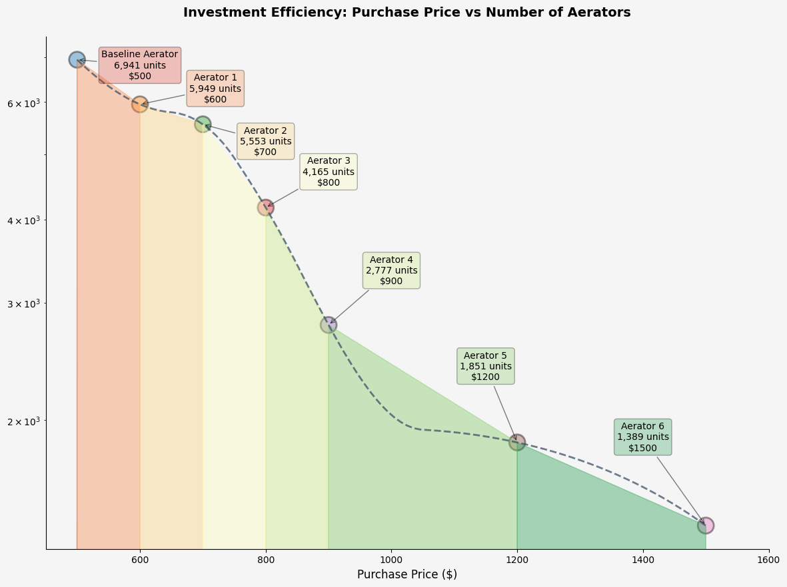
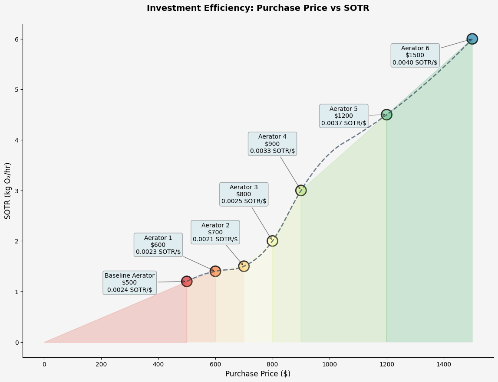
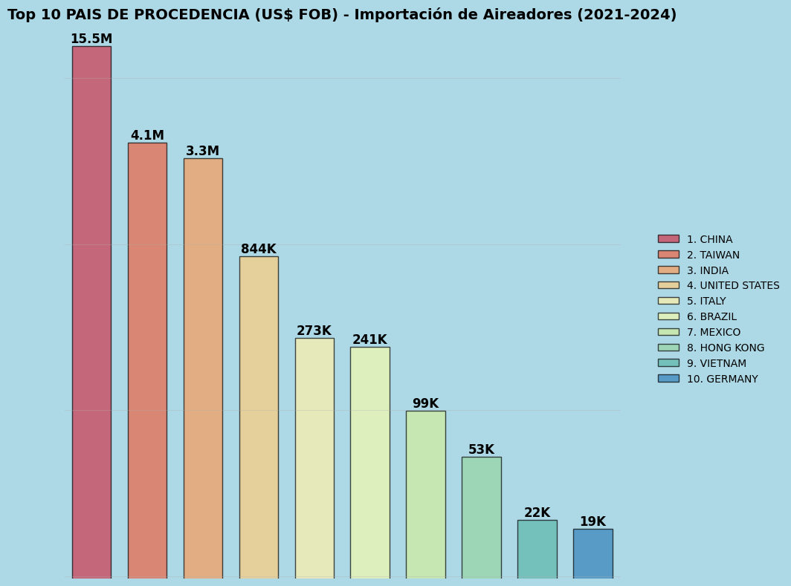
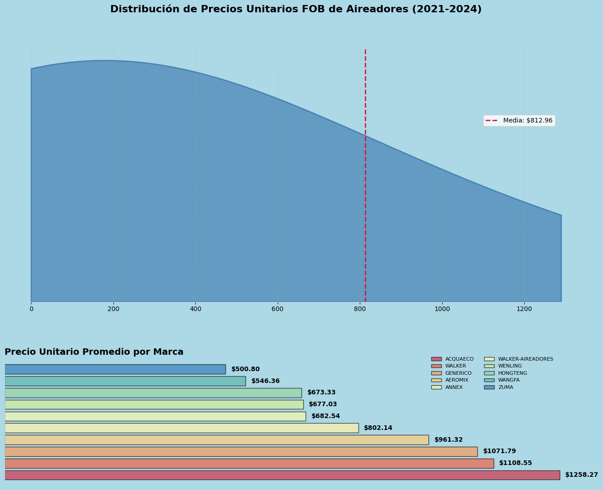

# DEVinatea: Data Analysis Portfolio

Where I keep all data analysis I perform in my projects. This repository contains crafted insights from data analyzed while developing other projects/applications.

## 📊 Overview

This is a structured repository for data analysis projects containing:

- Data wrangling scripts and examples
- Datasets (useful and experimental)
- Jupyter notebooks for various analyses
- Reusable analytics utilities

## 📁 Repository Structure

```
.
├── assets/               # Static assets and templates
│   ├── static/           # Static files like images
│   └── templates/        # Report templates
├── data/                 # All data files
│   ├── raw/              # Original, immutable data
│   ├── interim/          # Intermediate processed data
│   └── processed/        # Final, analysis-ready datasets
├── notebooks/            # Jupyter notebooks
├── reports/              # Generated analysis reports
└── src/                  # Source code and utilities
    └── utils/            # Reusable utility functions
```

## 🚀 Getting Started

### Prerequisites

- Python 3.9+
- Jupyter Notebook/Lab
- Required Python packages (see `requirements.txt`)

### Installation

1. Clone this repository

```bash
git clone https://github.com/luisvinatea/DEVinatea.git
cd DEVinatea
```

2. Create a virtual environment and install dependencies

```bash
# Using venv
python -m venv .venv
source .venv/bin/activate  # On Windows: .venv\Scripts\activate

# Install requirements
pip install -r requirements.txt
```

## 📝 Usage

1. Navigate to the `notebooks/` directory to find analysis examples
2. Use `template_data_analysis.ipynb` as a starting point for new analyses
3. Store raw data in `data/raw/` and processed outputs in `data/processed/`
4. Add reusable functions to `src/utils/` for code that's used across multiple notebooks

## 🔍 Featured Analyses

- **Aerators Efficiency Analysis**: Relative efficiency and profitability assessment for aerators in aquaculture systems.



- **Aerator Imports Analysis**: Analysis of aerator imports in Ecuador, including trends and insights.



## 📄 License

This project is licensed under the MIT License - see the [LICENSE](LICENSE) file for details.
