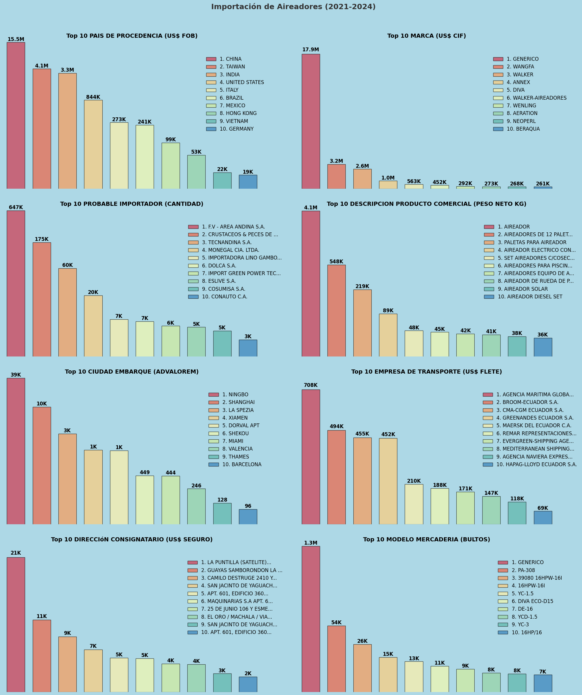
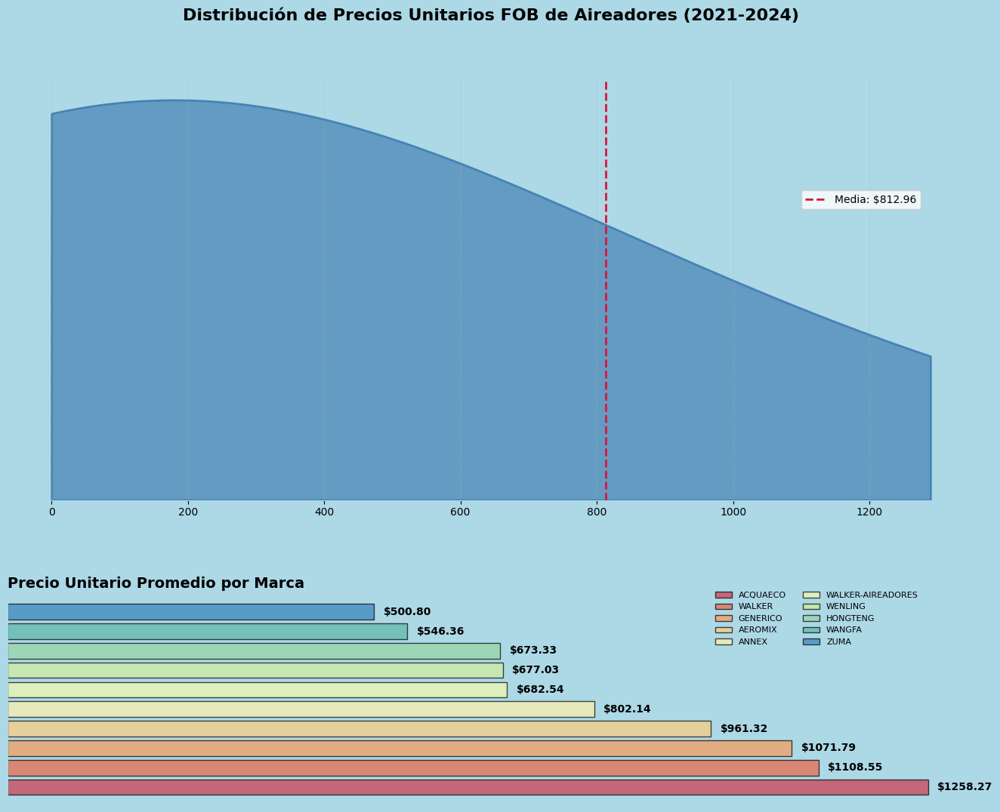
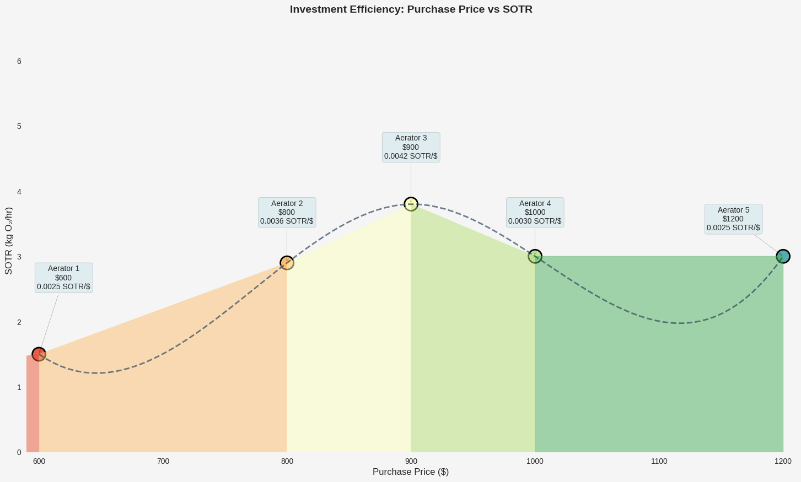
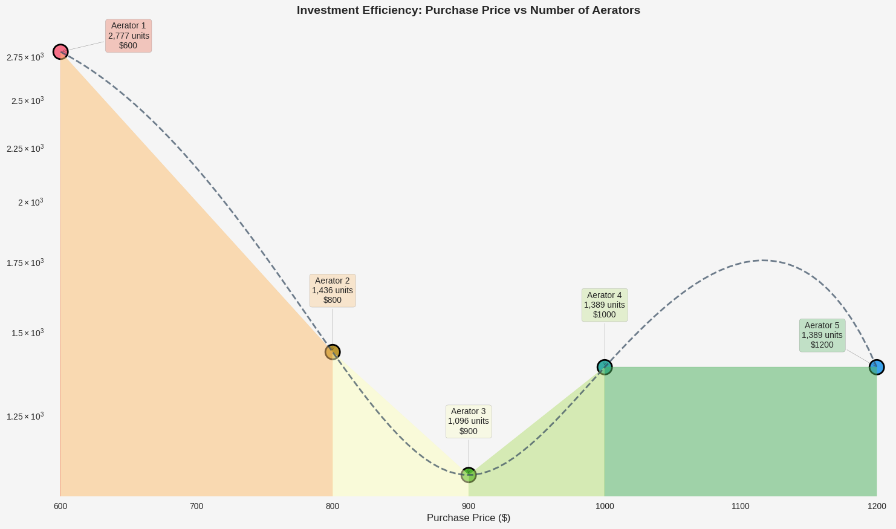
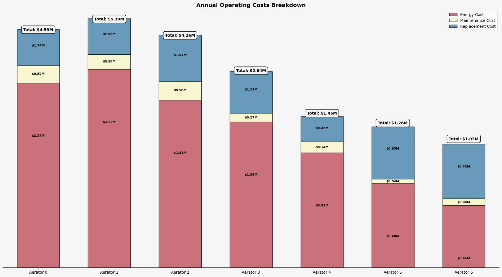
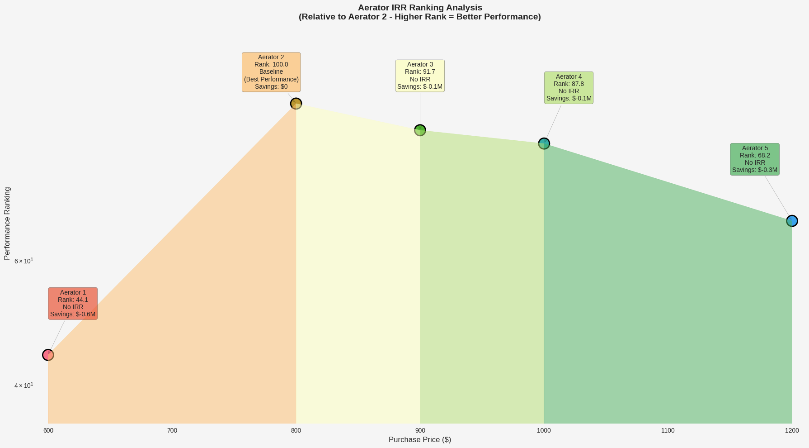
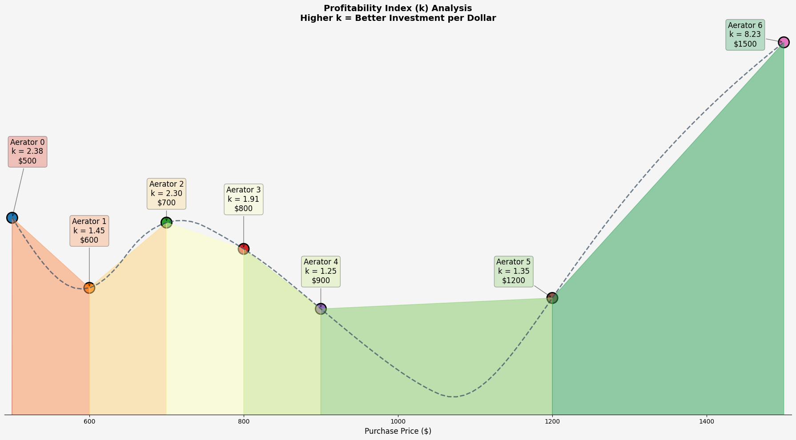
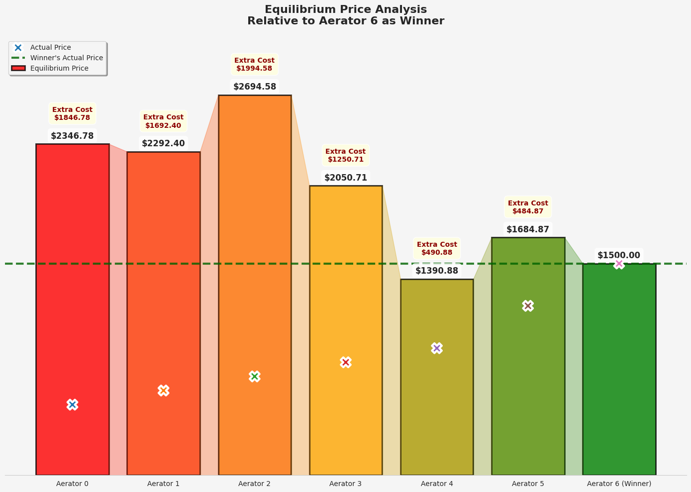

# Analysis of Aerators for Shrimp Farming: Cost Optimization and the Real Cost of "Cheap"

**Author:** Luis Paulo Vinatea Barberena  
**Affiliation:** BarberNode  
**Correspondence:** luisvinatea@icloud.com, +55 48 99221-9675  
**Address:** Servidao das Caranhas, 22, Barra da Lagoa, Florianopolis, SC, Brazil, 88061635  
**Date:** 2025-05-02

---

## Abstract

Aerator selection is a critical economic decision in shrimp farming,
often complicated by the trade-off between initial cost and long-term
operational efficiency. This paper presents an analysis comparing two
aerator options within the context of a specific shrimp farm,
integrating Léon Walras\'s General Equilibrium Theory and Friedrich von
Wieser\'s concept of Opportunity Cost. The study evaluates aerators
based on updated technical performance metrics (including
Temperature-Adjusted Oxygen Transfer Rate - $OTR_T$ and Standard
Aeration Efficiency - $SAE$) derived from the farm's Total Oxygen
Demand ($TOD$) and detailed, adapted financial indicators (Net Present
Value - $NPV$, Internal Rate of Return - $IRR$, Payback Period,
Return on Investment - $ROI$, Profitability Index - $k$, Opportunity
Cost, and Equilibrium Price) tailored for equipment comparison. Results
from the specific case study demonstrate that prioritizing higher
efficiency (Aerator 2) over lower initial unitary cost (Aerator 1) leads
to substantial long-term savings, a significantly positive $NPV$, high
interpreted $ROI$ and $IRR$, rapid payback, and a considerable
opportunity cost associated with choosing the less efficient option. The
analysis underscores the importance of applying robust economic
principles and adapted technical-financial assessments for optimizing
operational costs and ensuring financial sustainability in shrimp
aquaculture (Boyd & Hanson, 2021; The Fish Site, 2021).

**Keywords:** Shrimp Farming, Aquaculture Economics, Aerator Efficiency, Opportunity Cost, Cost Optimization, Mathematical Modeling, Financial Analysis, Equipment Comparison Metrics

## Highlights

- Higher efficiency aerators reduce long-term costs in shrimp farming.
- Adapted financial metrics reveal flaws in traditional equations.
- Opportunity cost of low-efficiency aerators exceeds $14M in
    $NPV$.
- In-loco data confirms poor performance of low-durability aerators.

## 1. Introduction

The economic analysis of optimal aerator choice in shrimp farming
benefits from the General Equilibrium Theorem developed by Léon Walras
in the 19th century, complemented by Friedrich von Wieser\'s concept of
opportunity cost, introduced in 1914. Walras proposed a framework to
understand how interconnected markets reach simultaneous equilibrium,
where supply equals demand through relative prices (Walras, 1874). This
approach is useful for analyzing complex systems like shrimp farms,
where multiple \"markets\" (oxygen, energy, shrimp, operating costs)
interact to maximize profitability (Asche et al., 2021). Opportunity
cost measures the value of the best alternative forgone, evaluating
aerator options (Boyd & Hanson, 2021).

### 1.1 Analogy with the Oxygen Market and Opportunity Cost

In shrimp farming, dissolved oxygen is a critical input. An "internal
oxygen market" can be conceptualized where demand (Total Oxygen Demand,
$TOD$) is driven by shrimp and microbial needs, and supply depends on
aerators' Temperature-Adjusted Oxygen Transfer Rate ($OTR_T$).
Aerators interact with energy, maintenance, and replacement markets,
connecting to the external shrimp market. Walras\'s Theorem suggests
equilibrium when these markets adjust simultaneously. Choosing a
cheaper, less efficient aerator incurs an opportunity cost equal to the
net present value of savings forgone by not selecting the more efficient
option (Boyd & Hanson, 2021; Susilowati et al., 2021).

### 1.2 The Cake Recipe: Why Assuming \$HP\$ per Pound of Shrimp is Incorrect

Assuming a fixed horsepower ($HP$)-per-production ratio is erroneous.
Shrimp production depends on multiple factors (dissolved oxygen,
temperature, salinity, density). Aerator $HP$ does not directly equate
to oxygen supply; $OTR_T$ is critical. Fixed $HP$ ratios ignore
interdependencies, leading to inefficient investments in low-$OTR_T$
aerators and significant opportunity costs (Boyd, 2015; Responsible
Seafood Advocate, 2022).

### 1.3 Original Equation of Léon Walras\'s General Equilibrium

Walras formalized general equilibrium with supply/demand equations,
subject to Walras\'s Law (excess demands sum to zero). Equilibrium
prices are found via \"tâtonnement\" (Walras, 1874). In shrimp farming,
equilibrium involves optimizing aerator costs, meeting $TOD$,
maximizing profits, and accounting for opportunity cost (Asche et al.,
2021; Valderrama et al., 2023).

### 1.3 Context Overview

This paper analyzes several aerators in a specific shrimp farm context,
integrating updated technical performance metrics and adapted financial
indicators. The study evaluates aerators based on Standard Oxygen
Transfer Rate ($SOTR$), to fulfill a 1000 hectares Shrimp Farm for a
given Total Oxygen Demand ($TOD$), and derives financial indicators
tailored for equipment comparison. Results demonstrate that prioritizing
higher efficiency leads to substantial long-term savings, a
significantly positive $NPV$, high interpreted $ROI$ and $IRR$,
rapid payback, and a considerable opportunity cost associated with
choosing the less efficient option.

### 1.4 Aerator Market in Ecuador

The Ecuadorian aerator market is characterized by a wide range of
options, from low-cost, low-efficiency models to high-performance,
high-cost alternatives. The choice of aerator significantly impacts
operational costs and shrimp yield. The market is influenced by factors
such as energy prices, shrimp prices, and technological advancements in
aeration systems. Understanding the trade-offs between initial
investment and long-term operational efficiency is crucial for shrimp
farmers aiming to optimize their production systems (Boyd & Hanson,
2021; The Fish Site, 2021).

By analysing aerator imports from Ecuador\'s customs database, in the
period of 2021 to 2024, we can gain insights on market trends, pricing
strategies, and the competitive landscape of aerator suppliers in the
region.

After performing data manipulation techniques, we can observe the
following patterns:

_Figure 1. Dashboard showing aerator imports (2021-2024) across multiple dimensions including countries of origin, importers, and product descriptions._

The dashboard on aerator imports (2021-2024) reveals some insights
across multiple dimensions. China dominates as the top country of origin
with $15.5M ($FOB$), followed by Taiwan at $4.1M, while generic
brands lead at $17.9M ($CIF$), far ahead of Wangfa at $3.2M. In
terms of importers, Area Andina S.A. handles the highest volume at 647K
units, with Crustáceos y Peces de Sudamerica as the second-largest at
137K units. Product descriptions show aerators of 12-16 pallet units
leading at 548K kg (net weight), indicating a focus on bulk shipments.
Ningbo is the top embarkation city with 398K units (ad valorem), and
Agencia Maritima Global moves 708K units (freight value), highlighting
their logistical prominence. Consignee directions peak with La Puntilla
(Satellite) at 211K units (insured value), and the generic model
category tops brokered models at 154K units, reflecting market
preferences for cost savings.

_Figure 2. Distribution of FOB unit prices for different aerator brands, showing pricing landscape from budget to premium segments._

The aerator prices chart (2021-2024) shows a highly skewed distribution
of FOB unit prices, with a mean of $812.96, indicating that most
brands have prices below this value, but a long tail extends to
$1200+. Acquaeco has the highest average unit price at $1258.27,
followed by Walker at $1108.55, suggesting they cater to a premium
segment. In contrast, Zuma offers the lowest average at $500.80,
followed by WangFa at $546.36, positioning them as budget options.
Other brands like Hongteng ($673.33), and Aerex ($802.14) cluster
closer to the mean, while Wenling ($961.32) and Annex ($1021.79)
sit between the mid-range and high-end, reflecting a diverse pricing
landscape in the aerator market.

## 2. Case Study: Comparing Different Aerator Options for an Ecuadorian Shrimp Farm

### 2.1 Case Study Overview and Parameters

This case study examines an intensive shrimp farm in Ecuador with 1,000
hectares of production area. The farm operates at a tropical water
temperature of 31.5°C, which significantly affects oxygen transfer
efficiency through the established temperature correction factor
($\theta = 1.024$). The farm's Total Oxygen Demand ($TOD$) is
calculated at 5.47 $\text{kg O}_2/hr/hectare$, resulting in a
substantial total requirement of 5,470 $\text{kg O}_2/hr$ across
the entire operation.

For this analysis, we compare seven different paddlewheel aerator models (Aerator 0 through Aerator 6), all operating at the standard power rating of 3 $HP$ (2.238 $kW$). These aerators exhibit varying performance characteristics:

**Table 2: Case Study Parameters**

| Parameter             | Value          |
| :-------------------- | :------------- |
| Production scale      | 1,000 hectares |
| Operating temperature | 31.5°C         |
| Energy cost           | $0.05/kWh      |
| Daily aeration        | 8 hours        |
| Shrimp density        | 0.33 kg/m³     |
| Culture period        | 120 days       |
| Shrimp market price   | $5.00/kg       |
| Annual discount rate  | 10%            |
| Annual inflation rate | 3%             |
| Analysis timeframe    | 10 years       |

### 2.2 Aerator Investment Options

The aerators under consideration present a classic economic dilemma: less expensive models with lower efficiency versus higher-priced models with superior oxygen transfer rates. While Aerator 0 has the lowest initial cost ($500), it does not offer the lowest operational cost. Aerator 1, despite being more expensive ($600), delivers lower $SOTR$ ($1.0 \text{kg O}_2/hr \text{ vs. } 1.2 \text{kg O}_2/hr$). The most efficient option, Aerator 6, transfers 6.0 $\text{kg O}_2/hr$ but costs $1,500 per unit.

The economic challenge is compounded by differences in durability (ranging from 2.0 to 6.0 years) and maintenance costs (from $20 to $90 per unit annually). This creates complex trade-offs between initial investment and long-term operational expenses. The total number of aerators required varies dramatically between options due to their different oxygen transfer capacities, directly impacting both initial investment and ongoing operational costs.

**Table 1: Aerator Specifications and Costs**

| Aerator Model | $SOTR$ ($\text{kg O}_2/hr$) | Purchase Price ($) | Maintenance Cost ($/year) | Durability (years) |
| :-----------: | :-------------------------: | :----------------: | :-----------------------: | :----------------: |
|   Aerator 0   |             1.2             |        500         |            85             |        2.0         |
|   Aerator 1   |             1.0             |        600         |            70             |        2.5         |
|   Aerator 2   |             1.5             |        700         |            90             |        2.0         |
|   Aerator 3   |             2.0             |        800         |            40             |        3.0         |
|   Aerator 4   |             3.0             |        900         |            50             |        6.0         |
|   Aerator 5   |             4.5             |        1200        |            20             |        3.5         |
|   Aerator 6   |             6.0             |        1500        |            30             |        4.0         |

### 2.3 Parameters Used

##### 2.3.1 Standard Oxygen Transfer Rate ($SOTR$)

The baseline oxygen transfer capacity under standard conditions (20°C, 0
DO, 1 atm), measured in $\text{kg O}_2/hr$ (Kumar et al., 2020).

##### 2.3.2 Temperature-Adjusted Oxygen Transfer Rate ($OTR_T$)

$$\text{OTR}_T = (\text{SOTR} \times 0.5) \times \theta^{(T-20)}$$

Where $\theta = 1.024$ (temperature correction factor) (Boyd, 2015).

##### 2.3.3 Standard Aeration Efficiency ($SAE$)

$$\text{SAE} = \frac{\text{SOTR}}{\text{Power (kW)}} (\text{kg } \text{O}_2/\text{kWh})$$

Where $\text{Power (kW)} = \text{Power (HP)} \times 0.746$ (Kumar
et al., 2020).

_Figure 3. Comparison of aerator performance metrics including Standard Oxygen Transfer Rate (SOTR) and Standard Aeration Efficiency (SAE)._

##### 2.3.4 Aerator Quantity Calculation

$$\text{Number of Aerators} = \left\lceil \frac{\text{TOD}}{\text{OTR}_T} \right\rceil$$

_Figure 4. Number of aerators required for each model to meet the farm's Total Oxygen Demand (TOD)._

### 2.3.5 Annual Revenue

$$\text{Total Initial Cost} = \text{Number of Aerators} \times \text{Cost per Aerator}$$

Production depends on density, depth, area, and culture cycles (Engle,
2010).

### 2.3.6 Initial Investment

$$\text{Total Initial Cost} = \text{Number of Aerators} \times \text{Cost per Aerator}$$

### 2.3.7 Annual Operating Costs

1.  **Energy Cost:** $\text{Power (kW)} \times \text{Energy Cost (\$/kWh)} \times \text{Operating Hours per Year} \times \text{Number of Aerators}$
2.  **Maintenance Cost:** $\text{Maintenance Cost per Unit per Year} \times \text{Number of Aerators}$
3.  **Replacement Cost (Annualized):** $(\text{Number of Aerators} \times \text{Cost per Aerator}) / \text{Durability (years)}$

_Figure 5. Breakdown of annual operating costs including energy, maintenance, and replacement costs for each aerator model._

### 2.4 Financial Indicators

#### 2.4.1 Net Present Value (NPV) of Savings

$$\text{NPV}_{\text{Savings}} = \sum_{i=1}^{n} \frac{\text{Annual Saving}_{\text{Year 1}} \times (1 + r_{\text{inflation}})^{i-1}}{(1 + r_{real})^i}$$

Where $r_{real} = \frac{1 + r_{nominal}}{1 + r_{inflation}} - 1$
(Intelligon, 2022; Susilowati et al., 2021).

### 2.4.2 Adapted Financial Metrics

#### 2.4.2.1 Internal Rate of Return (IRR)

$$0 = - \Delta I + \sum_{i=1}^{n} \frac{S_{yr1} \times (1 + r_{\text{inflation}})^{i-1}}{(1 + \text{IRR})^i}$$

If $\Delta I \leq 0$, standard IRR is undefined; adapted IRR anchors
against baseline cost, scaled by SOTR ratio, capped at 100% (Kumar et
al., 2020).

_Figure 6. Internal Rate of Return (IRR) comparison showing financial attractiveness of each aerator option._

### 2.4.2.1 Payback Period

$$
\text{Payback Period} = \begin{cases}
\frac{0.01}{R_{\text{SOTR}}} & \text{if } \Delta I < 0 \text{ and } S_{\text{yr1}} > 0 \\
\frac{\Delta I}{S_{\text{yr1}}} & \text{if } \Delta I \geq 0 \text{ and } S_{\text{yr1}} > 0 \\
\infty & \text{if } S_{\text{yr1}} \leq 0
\end{cases}
$$

Where:

- $R_{SOTR} = \frac{S_{yr1}}{C_{base}} \times R_{SOTR}$
- $C_{base}$ is the baseline cost (Engle, 2010)

### 2.4.2.2 Relative Return on Investment (ROI)

$$
\text{ROI}_{\text{relative}} = \begin{cases}
\min\left( \left( \frac{S_{\text{yr1}}}{C_{\text{base}}} \times R_{\text{SOTR}} \times (1 + F_{\text{cost\_sav}}) \right) \times 100, R_{\text{SOTR}} \times 100 \right) & \text{if } \Delta I < 0 \\
\min\left( \left( \frac{S_{\text{yr1}}}{C_{\text{base}}} \times R_{\text{SOTR}} \right) \times 100, R_{\text{SOTR}} \times 100 \right) & \text{if } \Delta I = 0 \\
\min\left( \left( \frac{S_{\text{yr1}}}{\Delta I} \right) \times 100, R_{\text{SOTR}} \times 100 \right) & \text{if } \Delta I > 0 \\
0 & \text{if } S_{\text{yr1}} \leq 0
\end{cases}
$$

**Note**: Conditions are: $S_{\text{yr1}} > 0$ and $C_{\text{base}} > 0$

Where:

- $F_{cost\_sav} = \frac{|\Delta I|}{C_{base}}$
- If $\Delta I \leq 0$, relative ROI is based on savings relative to baseline cost, scaled by SOTR ratio (Intelligon, 2022)

### 2.4.2.3 Profitability Index ($k$)

$$
k_{\text{relative}} = \begin{cases}
k_{\text{base}} \times (1 + F_{\text{cost\_sav}}) & \text{if } \Delta I < 0 \\
k_{\text{base}} & \text{if } \Delta I = 0 \\
k_{\text{base}} \times F_{\text{cost}} & \text{if } \Delta I > 0 \\
0 & \text{if } \text{NPV}_{\text{sav}} \leq 0
\end{cases}
$$

**Note**: Condition is $C_{\text{base}} > 0$

Where:

- $k_{base} = \frac{NPV_{sav}}{C_{base}} \times R_{SOTR}$
- $F_{cost, eq} = \frac{|\Delta I|}{C_{base}}$
- $F_{cost} = \frac{C_{base}}{C_{base} + \Delta I}$ (Engle, 2010)

_Figure 7. Profitability Index (k) showing the relative profitability of different aerator investments._

### 2.4.2.4 Equilibrium Price ($P_{eq}$)

$$
P_{\text{eq}} = \begin{cases}
\max\left(0, P_{\text{base}} \times R_{\text{SOTR}} \times \left(\frac{1}{1 + F_{\text{cost, eq}}}\right)\right) & \text{if } C_{\text{base}} > 0 \\
\max\left(0, P_{\text{base}} \times R_{\text{SOTR}}\right) & \text{if } C_{\text{base}} \leq 0 \\
0 & \text{otherwise}
\end{cases}
$$

**Note**: Condition is $P_{\text{base}} > 0$

Where:

- $P_{base} = \frac{(C_{\text{annual, non-winner}} - (C_{E, \text{winner}} + C_{M, \text{winner}})) \times D_{\text{winner}}}{N_{\text{winner}}}$
- $F_{cost, eq} = \frac{P_{base}}{C_{base}}$ (Asche et al., 2021)

_Figure 8. Market equilibrium analysis showing theoretical prices based on Walras's General Equilibrium Theory._

### 2.4.2.5 Opportunity Cost

$$\text{Opportunity Cost}_{\text{baseline}} = \text{NPV}_{\text{Savings (winner vs. baseline)}}$$

Quantifies economic loss from less efficient equipment (Boyd & Hanson,
2021; Susilowati et al., 2021).

## 3. Results

### 3.1 Aerator Performance Summary

**Table 3: Aerator Performance and Cost Efficiency Metrics**

|  Aerator  | $SOTR$ ($\text{kg O}_2/hr$) | Price ($) | Annual Production ($\text{kg O}_2/year$) | Cost Efficiency ($/\text{kg O}_2$) | Cost per SOTR ($/\text{SOTR}$) | SOTR per Dollar |
| :-------: | :-------------------------: | :-------: | :--------------------------------------: | :--------------------------------: | :----------------------------: | :-------------: |
| Aerator 0 |             1.2             |   $500    |                  2,301                   |               $0.142               |              $417              |     0.0024      |
| Aerator 1 |             1.0             |   $600    |                  1,918                   |               $0.170               |              $600              |     0.0017      |
| Aerator 2 |             1.5             |   $700    |                  2,877                   |               $0.114               |              $467              |     0.0021      |
| Aerator 3 |             2.0             |   $800    |                  3,836                   |               $0.085               |              $400              |     0.0025      |
| Aerator 4 |             3.0             |   $900    |                  5,753                   |               $0.057               |              $300              |     0.0033      |
| Aerator 5 |             4.5             |  $1,200   |                  8,630                   |               $0.038               |              $267              |     0.0037      |
| Aerator 6 |             6.0             |  $1,500   |                  11,507                  |               $0.028               |              $250              |     0.0040      |

### 3.2 Farm-Scale Financial Analysis

**Farm Parameters:** 1,000 hectares, $TOD$: 5,470 $\text{kg O}_2/hr$, Annual Revenue: $16.6M, Analysis Period: 10 years

**Table 4: Farm-Scale Investment and Operating Cost Analysis**

|  Aerator  | Quantity Required | Units/Hectare | Initial Investment ($M) | Annual Energy Cost ($M) | Annual Maintenance ($M) | Annual Replacement ($M) | Total Annual Cost ($M) | Cost as % Revenue | NPV Opportunity Cost ($M) |
| :-------: | :---------------: | :-----------: | :---------------------: | :---------------------: | :---------------------: | :---------------------: | :--------------------: | :---------------: | :-----------------------: |
| Aerator 0 |       6,941       |     6.94      |          $3.47          |          $2.27          |          $0.59          |          $1.74          |         $4.59          |       27.7%       |           $28.6           |
| Aerator 1 |       8,329       |     8.33      |          $5.00          |          $2.72          |          $0.58          |          $2.00          |         $5.30          |       32.0%       |           $34.3           |
| Aerator 2 |       5,553       |     5.55      |          $3.89          |          $1.81          |          $0.50          |          $1.94          |         $4.26          |       25.7%       |           $25.9           |
| Aerator 3 |       4,165       |     4.17      |          $3.33          |          $1.36          |          $0.17          |          $1.11          |         $2.64          |       15.9%       |           $13.0           |
| Aerator 4 |       2,777       |     2.78      |          $2.50          |          $0.91          |          $0.14          |          $0.42          |         $1.46          |       8.8%        |           $3.6            |
| Aerator 5 |       1,851       |     1.85      |          $2.22          |          $0.60          |          $0.04          |          $0.63          |         $1.28          |       7.7%        |           $2.1            |
| Aerator 6 |       1,389       |     1.39      |          $2.08          |          $0.45          |          $0.04          |          $0.52          |         $1.02          |       6.1%        |           $0.0            |

### 3.3 Financial Metrics Analysis

**Advanced Financial Indicators:** IRR, ROI, Payback Period, Profitability Index, and Equilibrium Price

**Table 5: Comprehensive Financial Performance Metrics**

|  Aerator  | Internal Rate of Return (%) | Return on Investment (%) | Payback Period (Years) | Profitability Index ($k$) | Standard Aeration Efficiency ($\text{kg O}_2/kWh$) | Temperature-Adjusted $OTR_T$ ($\text{kg O}_2/hr$) | Total Power Required ($HP$) | HP per Hectare |
| :-------: | :-------------------------: | :----------------------: | :--------------------: | :-----------------------: | :------------------------------------------------: | :-----------------------------------------------: | :-------------------------: | :------------: |
| Aerator 0 |           51.58%            |          20.00%          |          1.94          |           2.38            |                        0.72                        |                       0.79                        |           20,823            |     20.82      |
| Aerator 1 |           24.52%            |          16.67%          |          4.08          |           1.45            |                        0.60                        |                       0.66                        |           24,987            |     24.99      |
| Aerator 2 |           44.93%            |          25.00%          |          2.23          |           2.30            |                        0.90                        |                       0.99                        |           16,659            |     16.66      |
| Aerator 3 |           43.29%            |          33.33%          |          2.31          |           1.91            |                        1.20                        |                       1.31                        |           12,495            |     12.49      |
| Aerator 4 |           53.64%            |          21.96%          |          1.86          |           1.25            |                        1.80                        |                       1.97                        |            8,331            |      8.33      |
| Aerator 5 |           141.64%           |          19.19%          |          0.71          |           1.35            |                        2.70                        |                       2.96                        |            5,553            |      5.55      |
| Aerator 6 |           205.76%           |         100.00%          |          0.49          |           8.23            |                        3.59                        |                       3.94                        |            4,167            |      4.17      |

### 3.4 Equilibrium Price Analysis

**Market Equilibrium:** Theoretical prices based on Walras's General Equilibrium Theory (relative to Aerator 6 as winner)

**Table 6: Market Equilibrium and Cost-Effectiveness Analysis**

|  Aerator  | Actual Price ($) | Equilibrium Price ($) | Price Difference ($) |   Market Status    | Durability (Years) | Annual Maintenance ($/unit) | Cost-Effectiveness Rating |
| :-------: | :--------------: | :-------------------: | :------------------: | :----------------: | :----------------: | :-------------------------: | :-----------------------: |
| Aerator 0 |       $500       |       $2346.78        |       $1846.78       |    Underpriced     |        2.0         |             $85             |           Fair            |
| Aerator 1 |       $600       |       $2292.40        |       $1692.40       |    Underpriced     |        2.5         |             $70             |           Poor            |
| Aerator 2 |       $700       |       $2694.58        |       $1994.58       |    Underpriced     |        2.0         |             $90             |           Fair            |
| Aerator 3 |       $800       |       $2050.71        |       $1250.71       |    Underpriced     |        3.0         |             $40             |           Good            |
| Aerator 4 |       $900       |       $1390.88        |       $490.88        |    Underpriced     |        6.0         |             $50             |         Excellent         |
| Aerator 5 |      $1,200      |       $1684.87        |       $484.87        |    Underpriced     |        3.5         |             $20             |         Excellent         |
| Aerator 6 |      $1,500      |       $1500.00        |        $0.00         | Winner (Reference) |        4.0         |             $30             |         Excellent         |

### 3.5 Marginal Analysis

**Table 7: Marginal Returns and Upgrade Path Analysis**

|        Upgrade Path        | Additional Investment ($) | SOTR Gain ($\text{kg O}_2/hr$) | Production Gain ($\text{kg O}_2/year$) | Aerator Count Change | SOTR per Dollar | Production per Dollar ($\text{kg O}_2/year/$) | Derivative (Slope) | Cumulative Gain ($\text{kg O}_2$) |
| :------------------------: | :-----------------------: | :----------------------------: | :------------------------------------: | :------------------: | :-------------: | :-------------------------------------------: | :----------------: | :-------------------------------: |
| Aerator 0 → to → Aerator 1 |           $100            |              -0.2              |                  -384                  |        1,388         |     -0.0020     |                     -3.8                      |      -0.0020       |                -10                |
| Aerator 1 → to → Aerator 2 |           $100            |              0.5               |                  959                   |        -2,776        |     0.0050      |                      9.6                      |       0.0050       |                -5                 |
| Aerator 2 → to → Aerator 3 |           $100            |              0.5               |                  959                   |        -1,388        |     0.0050      |                      9.6                      |       0.0050       |                50                 |
| Aerator 3 → to → Aerator 4 |           $100            |              1.0               |                 1,918                  |        -1,388        |     0.0100      |                     19.2                      |       0.0100       |                180                |
| Aerator 4 → to → Aerator 5 |           $300            |              1.5               |                 2,877                  |         -926         |     0.0050      |                      9.6                      |       0.0050       |                945                |
| Aerator 5 → to → Aerator 6 |           $300            |              1.5               |                 2,877                  |         -462         |     0.0050      |                      9.6                      |       0.0050       |               2160                |
