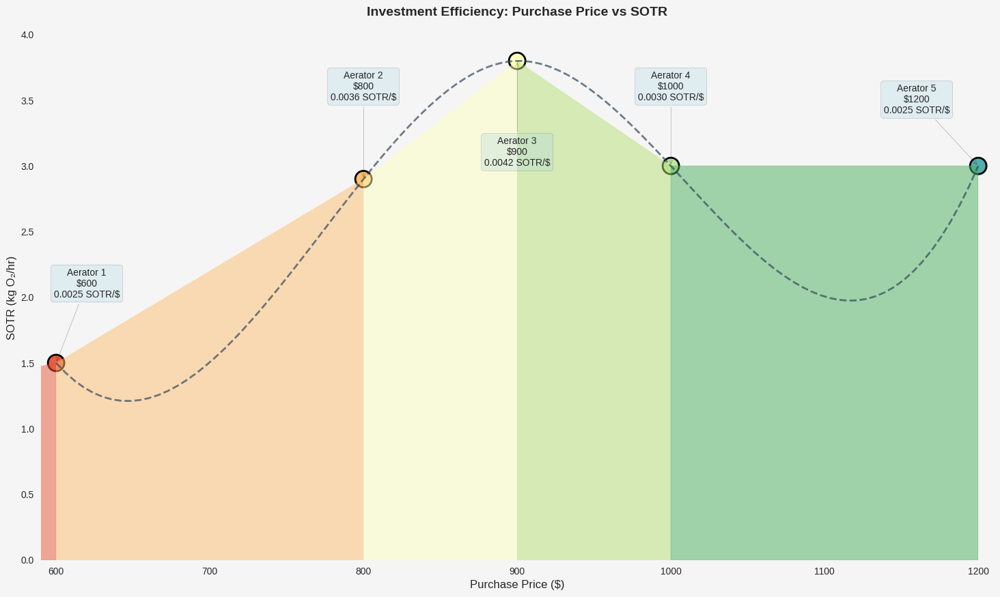
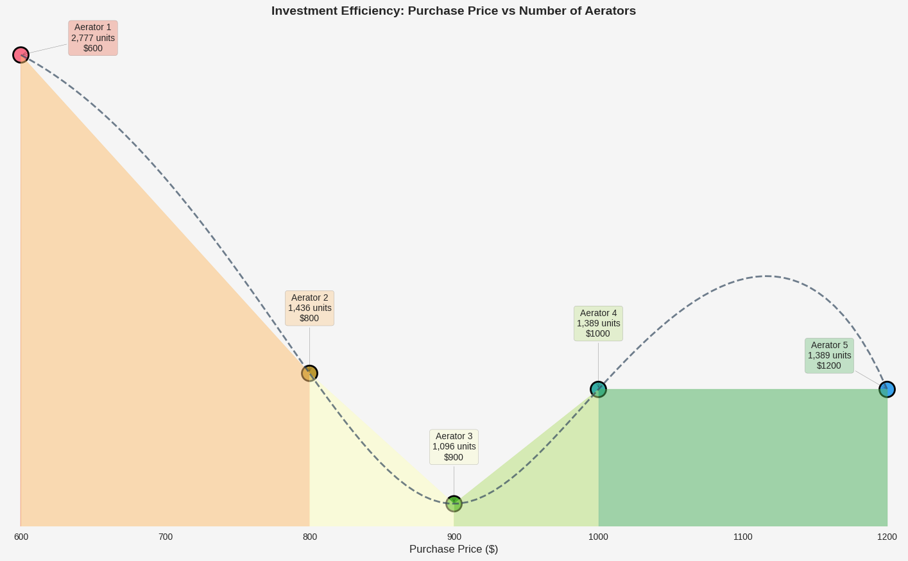
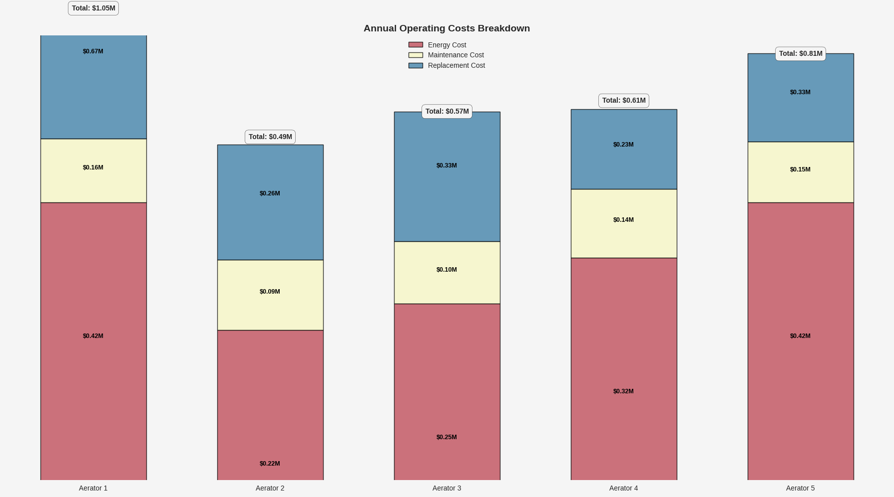
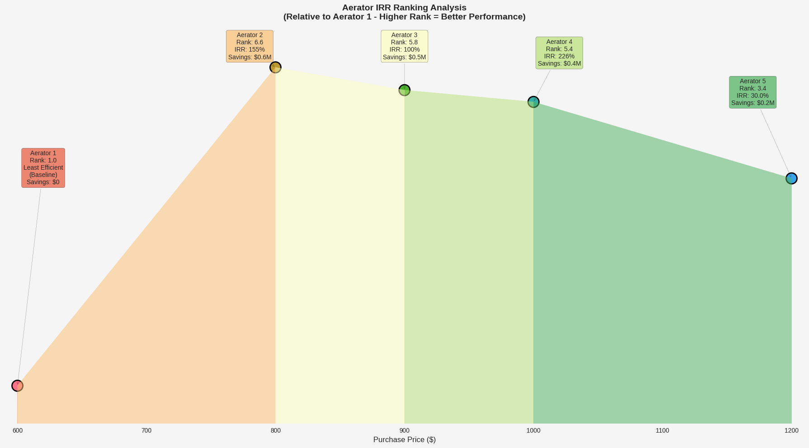

<h1 class="article-title">Analysis of Aerators for Shrimp Farming: Cost Optimization and the Real Cost of "Cheap"</h1>

    Luis Paulo Vinatea Barberena

    
BarberNode

    
<strong>Correspondence:</strong> luisvinatea@icloud.com, +55 48 99221-9675

    
<strong>Date:</strong> 2025-05-02

Abstract

Aerator selection is a critical economic decision in shrimp farming, often complicated by the trade-off between initial cost and long-term operational efficiency. This paper presents an analysis comparing two aerator options within the context of a specific shrimp farm, integrating Léon Walras's General Equilibrium Theory and Friedrich von Wieser's concept of Opportunity Cost. The study evaluates aerators based on updated technical performance metrics (including Temperature-Adjusted Oxygen Transfer Rate - OTRT and Standard Aeration Efficiency - SAE) derived from the farm's Total Oxygen Demand (TOD) and detailed, adapted financial indicators (Net Present Value - NPV, Internal Rate of Return - IRR, Payback Period, Return on Investment - ROI, Profitability Index - k, Opportunity Cost, and Equilibrium Price) tailored for equipment comparison. Results from the specific case study demonstrate that prioritizing higher efficiency (Aerator 2) over lower initial unitary cost (Aerator 1) leads to substantial long-term savings, a significantly positive NPV, high interpreted ROI and IRR, rapid payback, and a considerable opportunity cost associated with choosing the less efficient option. (Boyd & Hanson, 2021; The Fish Site, 2021).

    Keywords:
    Shrimp Farming, Aquaculture Economics, Aerator Efficiency, Opportunity Cost, Cost Optimization, Mathematical Modeling, Financial Analysis, Equipment Comparison Metrics

<h2 class="section-heading">1. Introduction</h2>

The economic analysis of optimal aerator choice in shrimp farming benefits from the General Equilibrium Theorem developed by Léon Walras in the 19th century, complemented by Friedrich von Wieser's concept of opportunity cost, introduced in 1914. Walras proposed a framework to understand how interconnected markets reach simultaneous equilibrium, where supply equals demand through relative prices (Walras, 1874). This approach is useful for analyzing complex systems like shrimp farms, where multiple "markets" (oxygen, energy, shrimp, operating costs) interact to maximize profitability (Asche et al., 2021). Opportunity cost measures the value of the best alternative forgone, evaluating aerator options (Boyd & Hanson, 2021).

<h3 class="subsection-heading">1.1 Analogy with the Oxygen Market and Opportunity Cost</h3>

In shrimp farming, dissolved oxygen is a critical input. An "internal oxygen market" can be conceptualized where demand (Total Oxygen Demand, TOD) is driven by shrimp and microbial needs, and supply depends on aerators' Temperature-Adjusted Oxygen Transfer Rate (OTRT). Aerators interact with energy, maintenance, and replacement markets, connecting to the external shrimp market. Walras's Theorem suggests equilibrium when these markets adjust simultaneously. Choosing a cheaper, less efficient aerator incurs an opportunity cost equal to the net present value of savings forgone by not selecting the more efficient option (Boyd & Hanson, 2021; Susilowati et al., 2021).

<h3 class="subsection-heading">1.2 The Cake Recipe: Why Assuming HP per Pound of Shrimp is Incorrect</h3>

Assuming a fixed horsepower (HP)-per-production ratio is erroneous. Shrimp production depends on multiple factors (dissolved oxygen, temperature, salinity, density). Aerator HP does not directly equate to oxygen supply; OTRT is critical. Fixed HP ratios ignore interdependencies, leading to inefficient investments in low-OTRT aerators and significant opportunity costs (Boyd, 2015; Responsible Seafood Advocate, 2022).

<h3 class="subsection-heading">1.3 Original Equation of Léon Walras's General Equilibrium</h3>

Walras formalized general equilibrium with supply/demand equations, subject to Walras's Law (excess demands sum to zero). Equilibrium prices are found via "tâtonnement" (Walras, 1874). In shrimp farming, equilibrium involves optimizing aerator costs, meeting TOD, maximizing profits, and accounting for opportunity cost (Asche et al., 2021; Valderrama et al., 2023).

<h3 class="subsection-heading">1.4 Context Overview</h3>

This paper analyzes several aerators in a specific shrimp farm context, integrating updated technical performance metrics and adapted financial indicators. The study evaluates aerators based on Standard Oxygen Transfer Rate (SOTR), to fulfill a 1000 hectares Shrimp Farm for a given Total Oxygen Demand (TOD), and derives financial indicators tailored for equipment comparison. Results demonstrate that prioritizing higher efficiency leads to substantial long-term savings, a significantly positive NPV, high interpreted ROI and IRR, rapid payback, and a considerable opportunity cost associated with choosing the less efficient option.

<h3 class="subsection-heading">1.5 Aerator Market in Ecuador</h3>

The Ecuadorian aerator market is characterized by a wide range of options, from low-cost, low-efficiency models to high-performance, high-cost alternatives. The choice of aerator significantly impacts operational costs and shrimp yield. The market is influenced by factors such as energy prices, shrimp prices, and technological advancements in aeration systems. Understanding the trade-offs between initial investment and long-term operational efficiency is crucial for shrimp farmers aiming to optimize their production systems (Boyd & Hanson, 2021; The Fish Site, 2021).

By analysing aerator imports from Ecuador's customs database, in the period of 2021 to 2024, we can gain insights on market trends, pricing strategies, and the competitive landscape of aerator suppliers in the region.

After performing data manipulation techniques, we can observe the following patterns:

The dashboard on aerator imports (2021-2024) reveals some insights across multiple dimensions. China dominates as the top country of origin with 15.5M USD (FOB), followed by Taiwan at 4.1M USD, while generic brands lead at 17.9M USD (CIF), far ahead of Wangfa at 3.2M USD. In terms of importers, Area Andina S.A. handles the highest volume at 647K units, with Crustáceos y Peces de Sudamérica as the second-largest at 137K units. Product descriptions show aerators of 12-16 pallet units leading at 548K kg (net weight), indicating a focus on bulk shipments. Ningbo is the top embarkation city with 398K units (ad valorem), and Agencia Maritima Global moves 708K units (freight value), highlighting their logistical prominence. Consignee directions peak with La Puntilla (Satellite) at 211K units (insured value), and the generic model category tops brokered models at 154K units, reflecting market preferences for cost savings.

The aerator prices chart (2021-2024) shows a highly skewed distribution of FOB unit prices, with a mean of 812.96 USD, indicating that most brands have prices below this value, but a long tail extends to 1200 USD+. Acquaeco has the highest average unit price at 1258.27 USD, followed by Walker at 1108.55 USD, suggesting they cater to a premium segment. In contrast, Zuma offers the lowest average at 500.80 USD, followed by WangFa at 546.36 USD, positioning them as budget options. Other brands like Hongteng (673.33 USD), and Aerex (802.14 USD) cluster closer to the mean, while Wenling (961.32 USD) and Annex (1021.79 USD) sit between the mid-range and high-end, reflecting a diverse pricing landscape in the aerator market.

<h2 class="section-heading">2. Case Study: Comparing Different Aerator Options for an Ecuadorian Shrimp Farm</h2>

<h3 class="subsection-heading">2.1 Case Study Overview and Parameters</h3>

This case study examines an intensive shrimp farm in Ecuador with 1,000 hectares of production area. The farm operates at a tropical water temperature of 31.5°C, which significantly affects oxygen transfer efficiency through the established temperature correction factor (θ = 1.024). The farm's Total Oxygen Demand (TOD) is calculated at 5.47 kg O₂/hr/hectare, resulting in a substantial total requirement of 5,470 kg O₂/hr across the entire operation.

For this analysis, we compare five different paddlewheel aerator models (Aerator 1 through Aerator 5), all operating under a fixed cost of energy of 0.05 USD/Kwh. These aerators exhibit varying performance characteristics:

### Farm Parameters

| Parameter                 | Value           |
| ------------------------- | --------------- |
| Farm area                 | 1000 hectares   |
| Operating temperature     | 31.5°C          |
| Energy cost               | $0.05/kWh       |
| Daily aeration            | 8 hours         |
| Total Oxygen Demand (TOD) | 5,470 kg O₂/day |
| Annual shrimp production  | 18,250,000 kg   |
| Analysis period           | 10 years        |
| Discount rate             | 10%             |
| Annual inflation rate     | 3%              |

<h3 class="subsection-heading">2.2 Aerator Investment Options</h3>

The aerators under consideration present a classic economic dilemma: less expensive models with lower efficiency versus higher-priced models with superior oxygen transfer rates. While Aerator 1 has the lowest initial cost (600 USD), it does not offer the lowest operational cost, nor the highest efficiency.

The economic challenge is compounded by differences in durability (ranging from 2.0 to 6.0 years) and maintenance costs (from 85 USD to 160 USD per unit annually). This creates complex trade-offs between initial investment and long-term operational expenses. Another complexity factor is the varying power capacity of each model, where some require more energy to deliver the same SOTR as others. The total number of aerators required varies dramatically between options due to their different oxygen transfer capacities, directly impacting both initial investment and ongoing operational costs.

| Aerator Model | Power (HP) | SOTR (kg O₂/hr) | Purchase Price (USD) | Maintenance Cost (USD/year) | Durability (years) |
| ------------- | ---------- | --------------- | -------------------- | --------------------------- | ------------------ |
| Aerator 1     | 2          | 1.5             | 600                  | 85                          | 2.5                |
| Aerator 2     | 2          | 2.9             | 800                  | 95                          | 4.5                |
| Aerator 3     | 3          | 3.8             | 900                  | 125                         | 3.0                |
| Aerator 4     | 3          | 3.0             | 1000                 | 140                         | 6.0                |
| Aerator 5     | 4          | 3.0             | 1200                 | 160                         | 5.0                |

<h4 class="subsubsection-heading">2.3. Standard Oxygen Transfer Rate (SOTR)</h4>

The baseline oxygen transfer capacity under standard conditions (20°C, 0 DO, 1 atm), measured in kg O₂/hr (Kumar et al., 2020).

<h4 class="subsubsection-heading">2.3.1.2 Temperature-Adjusted Oxygen Transfer Rate (OTRT)</h4>

$$
OTR_T = \text{SOTR} \times 0.5 \times \theta^{(T-20)}
$$

Where $\theta = 1.024$ (temperature correction factor) (Boyd, 2015).

<h4 class="subsubsection-heading">2.3.1.3 Standard Aeration Efficiency (SAE)</h4>

$$
\text{SAE} = \frac{\text{SOTR}}{\text{Power (kW)}} \quad ( kg \ O_2 / \text{kWh})
$$

Where $\text{Power (kW)} = \text{Power (HP)} \times 0.746$ (Kumar et al., 2020).

<h4 class="subsubsection-heading">2.3.1.4 Aerator Quantity Calculation</h4>

$$
\text{Number of Aerators} = \left\lceil \frac{TOD}{OTR_T} \right\rceil
$$

<h4 class="subsubsection-heading">2.3.2 Annual Revenue</h4>

$$
\text{Annual Revenue} = \text{Total Annual Production (kg)} \times \text{Shrimp Price (\$/kg)}
$$

Production depends on density, depth, area, and culture cycles (Engle, 2010).

<h4 class="subsubsection-heading">2.3.3 Initial Investment</h4>

$$
\text{Total Initial Cost} = \text{Number of Aerators} \times \text{Cost per Aerator}
$$

<h4 class="subsubsection-heading">2.3.4 Annual Operating Costs</h4>

1. **Energy Cost:** $\text{Power (kW)} \times \text{Energy Cost (\$/kWh)} \times \text{Operating Hours per Year} \times \text{Number of Aerators}$
2. **Maintenance Cost:** $\text{Maintenance Cost per Unit per Year} \times \text{Number of Aerators}$
3. **Replacement Cost (Annualized):** $(\text{Number of Aerators} \times \text{Cost per Aerator}) / \text{Durability (years)}$

<h4 class="subsubsection-heading">2.3.6 Net Present Value (NPV) of Savings</h4>

$$
\text{NPV}_{\text{Savings}} = \sum_{i=1}^{n} \frac{\text{Annual Saving}_{\text{Year 1}} \times (1 + r_{\text{inflation}})^{i-1}}{(1 + r_{real})^i}
$$

Where $r_{real} = \frac{1 + r_{nominal}}{1 + r_{inflation}} - 1$ (Intelligon, 2022; Susilowati et al., 2021).

<h4 class="subsubsection-heading">2.3.7 Adapted Financial Metrics</h4>

Standard metrics (IRR, Payback, ROI, k) were adapted due to violations of positive incremental investment assumptions in aquaculture equipment comparison (Engle, 2010; Kumar et al., 2020).

<h4 class="subsubsection-heading">2.3.7.1 Internal Rate of Return (IRR) - Enhanced Calculation</h4>

The IRR calculation has been enhanced to properly handle different investment scenarios, particularly when comparing aerators with negative investment differences (lower cost + better performance):

**Case 1: Baseline Aerator (Least Efficient)**

$$
\text{IRR}_{\text{baseline}} = 0\%
$$

**Case 2: Negative Investment Difference ($\Delta I \leq 0$) with Annual Savings ($S_{\text{yr1}} > 0$)**

When an aerator costs less than baseline AND provides better performance:

$$
0 = |\Delta I| - \sum_{i=1}^{n} \frac{S_{\text{yr1}} \times (1 + r_{\text{inflation}})^{i-1}}{(1 + \text{IRR})^i}
$$

If numerical calculation fails or gives negative result:

$$
\text{IRR}_{\text{approx}} = \min\left(999\%, \frac{S_{\text{yr1}}}{|\Delta I|} - 1\right)
$$

**Case 3: Small Positive Investment Difference ($0 < \Delta I \leq 1000$)**

For very small investment differences that could cause mathematical instability:

$$
\text{IRR}_{\text{conservative}} = \min\left(30\%, \frac{S_{\text{yr1}}}{500,000}\right)
$$

**Case 4: Significant Positive Investment Difference ($\Delta I > 1000$)**

Standard IRR calculation:

$$
0 = -\Delta I + \sum_{i=1}^{n} \frac{S_{\text{yr1}} \times (1 + r_{\text{inflation}})^{i-1}}{(1 + \text{IRR})^i}
$$

**Mathematical Safeguards:**

- IRR values capped at 999% for display purposes
- Negative investment differences use absolute value in calculation
- Conservative scaling prevents unrealistic values from tiny denominators

This enhanced approach ensures accurate IRR calculations for all investment scenarios while maintaining financial validity.

<h4 class="subsubsection-heading">2.4.2.1 Payback Period</h4>

Payback period calculation depends on investment difference ($\Delta I$) and annual savings:

**Case 1: When $\Delta I < 0$ and $S_{\text{yr1}} > 0$ (cost savings with positive annual savings)**

$$
\text{Payback Period} = \frac{0.01}{R_{\text{SOTR}}}
$$

**Case 2: When $\Delta I \geq 0$ and $S_{\text{yr1}} > 0$ (additional investment with positive annual savings)**

$$
\text{Payback Period} = \frac{\Delta I}{S_{\text{yr1}}}
$$

**Case 3: When $S_{\text{yr1}} \leq 0$ (no annual savings)**

$$
\text{Payback Period} = \infty
$$

**Where:**  
• $R_{\text{SOTR}} = \frac{S_{\text{yr1}}}{C_{\text{base}}} \times R_{\text{SOTR}}$ (SOTR ratio factor)  
• $C_{\text{base}}$ is the baseline cost (Engle, 2010)

<h4 class="subsubsection-heading">2.4.2.2 Relative Return on Investment (ROI)</h4>

ROI calculation depends on investment difference ($\Delta I$) between candidate and baseline aerators:

**Case 1: When $\Delta I < 0$ (cost savings)**

$$
\text{ROI}_{\text{relative}} = \min\left( \left( \frac{S_{\text{yr1}}}{C_{\text{base}}} \times R_{\text{SOTR}} \times (1 + F_{\text{cost\_sav}}) \right) \times 100, R_{\text{SOTR}} \times 100 \right)
$$

**Case 2: When $\Delta I = 0$ (equal investment)**

$$
\text{ROI}_{\text{relative}} = \min\left( \left( \frac{S_{\text{yr1}}}{C_{\text{base}}} \times R_{\text{SOTR}} \right) \times 100, R_{\text{SOTR}} \times 100 \right)
$$

**Case 3: When $\Delta I > 0$ (additional investment)**

$$
\text{ROI}_{\text{relative}} = \min\left( \left( \frac{S_{\text{yr1}}}{\Delta I} \right) \times 100, R_{\text{SOTR}} \times 100 \right)
$$

**Case 4: When $S_{\text{yr1}} \leq 0$ (no savings)**

$$
\text{ROI}_{\text{relative}} = 0
$$

**Where:**  
• $F_{\text{cost\_sav}} = \frac{|\Delta I|}{C_{\text{base}}}$ (cost savings factor)  
• $S_{\text{yr1}} > 0$ and $C_{\text{base}} > 0$ (required conditions)  
• For $\Delta I \leq 0$: ROI based on savings relative to baseline cost, scaled by SOTR ratio

<h4 class="subsubsection-heading">2.4.2.3 Profitability Index ($k$)</h4>

Profitability Index calculation depends on investment difference ($\Delta I$) and NPV of savings:

**Case 1: When $\Delta I < 0$ (cost savings)**

$$
k_{\text{relative}} = k_{\text{base}} \times (1 + F_{\text{cost\_sav}})
$$

**Case 2: When $\Delta I = 0$ (equal investment)**

$$
k_{\text{relative}} = k_{\text{base}}
$$

**Case 3: When $\Delta I > 0$ (additional investment)**

$$
k_{\text{relative}} = k_{\text{base}} \times F_{\text{cost}}
$$

**Case 4: When $\text{NPV}_{\text{sav}} \leq 0$ (no positive NPV)**

$$
k_{\text{relative}} = 0
$$

**Where:**  
• $k_{\text{base}} = \frac{\text{NPV}_{\text{sav}}}{C_{\text{base}}} \times R_{\text{SOTR}}$ (base profitability index)  
• $F_{\text{cost\_sav}} = \frac{|\Delta I|}{C_{\text{base}}}$ (cost savings factor)  
• $F_{\text{cost}} = \frac{C_{\text{base}}}{C_{\text{base}} + \Delta I}$ (cost adjustment factor)  
• Condition: $C_{\text{base}} > 0$ (Engle, 2010)

<h4 class="subsubsection-heading">2.4.2.4 Equilibrium Price ($P_{eq}$)</h4>

Equilibrium price calculation based on market conditions and cost structure:

**Case 1: When $C_{\text{base}} > 0$ (normal baseline cost)**

$$
P_{\text{eq}} = \max\left(0, P_{\text{base}} \times R_{\text{SOTR}} \times \left(\frac{1}{1 + F_{\text{cost, eq}}}\right)\right)
$$

**Case 2: When $C_{\text{base}} \leq 0$ (zero or negative baseline cost)**

$$
P_{\text{eq}} = \max\left(0, P_{\text{base}} \times R_{\text{SOTR}}\right)
$$

**Case 3: Otherwise (invalid conditions)**

$$
P_{\text{eq}} = 0
$$

**Where:**  
• $P_{\text{base}} = \frac{(C_{\text{annual, non-winner}} - (C_{E, \text{winner}} + C_{M, \text{winner}})) \times D_{\text{winner}}}{N_{\text{winner}}}$ (baseline price)  
• $F_{\text{cost, eq}} = \frac{P_{\text{base}}}{C_{\text{base}}}$ (cost equilibrium factor)  
• Condition: $P_{\text{base}} > 0$ (Asche et al., 2021)

<h3 class="subsection-heading">2.4.3 Opportunity Cost Analysis</h3>

Opportunity cost represents the financial penalty of not choosing the most efficient aerator option. It quantifies the present value of additional costs incurred by selecting a suboptimal aerator.

**Opportunity Cost Calculation:**

**Case 1: Baseline Aerator (Least Efficient)**

$$
\text{Opportunity Cost}_{\text{baseline}} = 0
$$

**Case 2: Non-Winner Aerators**

For aerators that cost more to operate than the winner:

$$
\text{Opportunity Cost} = \text{NPV}\left(\sum_{i=1}^{n} \frac{(C_{\text{annual, aerator}} - C_{\text{annual, winner}}) \times (1 + r_{\text{inflation}})^{i-1}}{(1 + r_{\text{real}})^i}\right)
$$

**Case 3: Winner Aerator or Equal Performance**

$$
\text{Opportunity Cost}_{\text{winner}} = 0
$$

**Where:**

- $C_{\text{annual, aerator}}$ = Total annual cost of the evaluated aerator
- $C_{\text{annual, winner}}$ = Total annual cost of the most efficient aerator
- Positive opportunity cost indicates financial penalty vs optimal choice
- Zero opportunity cost indicates optimal or equivalent choice

This metric enables direct comparison of long-term financial impact across aerator options.

**Results Summary**

| Metric                            | Aerator 1     | Aerator 2   | Aerator 3   | Aerator 4   | Aerator 5     |
| --------------------------------- | ------------- | ----------- | ----------- | ----------- | ------------- |
| Unit Price                        | $600          | $800        | $900        | $1,000      | $1,200        |
| Power Rating                      | 2 HP          | 2 HP        | 3 HP        | 3 HP        | 4 HP          |
| SOTR (kg O2/hr)                   | 1.5           | 2.9         | 3.8         | 3.0         | 3.0           |
| OTRT (kg O2/hr)                   | 1.97          | 3.81        | 4.99        | 3.94        | 3.94          |
| Units Needed                      | 2777          | 1436        | 1096        | 1389        | 1389          |
| Initial Investment                | $1,160,231.82 | $799,948.58 | $686,863.92 | $967,208.02 | $1,160,649.62 |
| Annual Energy Cost                | $421,057      | $217,730    | $249,268    | $315,906    | $421,208      |
| Annual Maintenance                | $164,366      | $94,994     | $95,398     | $135,409    | $154,753      |
| Total Annual Cost                 | $1,049,515    | $490,491    | $573,620    | $612,517    | $808,091      |
| Cost per kg O2                    | $0.066        | $0.031      | $0.036      | $0.038      | $0.051        |
| Energy per kg O2                  | 0.76          | 0.39        | 0.45        | 0.57        | 0.76          |
| Annual Savings vs Least Efficient | $0            | $559,025    | $475,895    | $436,999    | $241,424      |

**Financial Analysis Summary**

| Financial Metric                  | Aerator 1              | Aerator 2   | Aerator 3   | Aerator 4   | Aerator 5     |
| --------------------------------- | ---------------------- | ----------- | ----------- | ----------- | ------------- |
| Initial Investment                | $1,160,231.82          | $799,948.58 | $686,863.92 | $967,208.02 | $1,160,649.62 |
| Annual Savings vs Least Efficient | $0                     | $559,025    | $475,895    | $436,999    | $241,424      |
| Net Present Value                 | $0                     | $4,323,913  | $3,847,586  | $3,291,458  | $1,711,341    |
| Internal Rate of Return           | 0.0% (Least Efficient) | 155.1%      | 100.4%      | 226.4%      | 30.0%         |
| Payback Period                    | 0.0 years              | 0.6 years   | 1.0 years   | 0.4 years   | 0.0 years     |
| SOTR Performance Ratio            | 1.00x                  | 1.93x       | 2.53x       | 2.00x       | 2.00x         |
| Profitability Index               | 1.00                   | 2.56        | 2.48        | 2.44        | 1.12          |
| Return on Investment              | 0.0%                   | 193.3%      | 253.3%      | 200.0%      | 50.0%         |
| Opportunity Cost (NPV)            | $0                     | Best Choice | $589,411    | $865,196    | $2,251,871    |

**Best Options Summary**

| Criteria                 | Best Option   |
| ------------------------ | ------------- |
| Best Initial Cost        | **Aerator 3** |
| Best Operating Cost      | **Aerator 2** |
| Best NPV                 | **Aerator 2** |
| Best IRR                 | **Aerator 4** |
| Best Profitability Index | **Aerator 2** |
| Best ROI                 | **Aerator 3** |
| Best Payback Period      | **Aerator 1** |
| **Most Efficient**       | **Aerator 2** |

**Farm Overview**

| Parameter Type               | Metric            | Value                                                                                                                                             |
| ---------------------------- | ----------------- | ------------------------------------------------------------------------------------------------------------------------------------------------- |
| **Total Oxygen Demand**      | Daily requirement | 5,470.0 kg/day                                                                                                                                    |
| **Annual Shrimp Production** | Total output      | 18,250,000 kg                                                                                                                                     |
| **Operation Schedule**       | Daily/Annual      | 8 hours/day, 365 days/year                                                                                                                        |
| **Finding**                  | Best value option | Aerator 2 provides the best overall value proposition, while choosing Aerator 1 results in significant opportunity costs over the analysis period |
| **Financial Impact**         | Opportunity cost  | The opportunity cost of choosing the least efficient option can exceed $559,025 annually                                                          |

**Opportunity Cost Analysis**

Cost of choosing each aerator instead of the most efficient option (Aerator 2):

| Aerator   | Annual Opportunity Cost | 10-Year NPV Opportunity Cost | Efficiency Ratio | Investment Decision |
| --------- | ----------------------- | ---------------------------- | ---------------- | ------------------- |
| Aerator 1 | $559,025                | $3,963,629                   | 1.00x            | MODERATE            |
| Aerator 2 | $0                      | $0                           | 1.93x            | **OPTIMAL**         |
| Aerator 3 | $83,130                 | $589,411                     | 2.53x            | CONSIDER            |
| Aerator 4 | $122,026                | $865,196                     | 2.00x            | CONSIDER            |
| Aerator 5 | $317,601                | $2,251,871                   | 2.00x            | CONSIDER            |

**Economic Interpretation**

- Opportunity cost represents the financial penalty of not choosing the most efficient option
- Higher efficiency ratios indicate better oxygen transfer performance relative to baseline
- NPV opportunity cost shows the present value of losses over 10 years
- Investment decisions balance efficiency gains against opportunity costs
